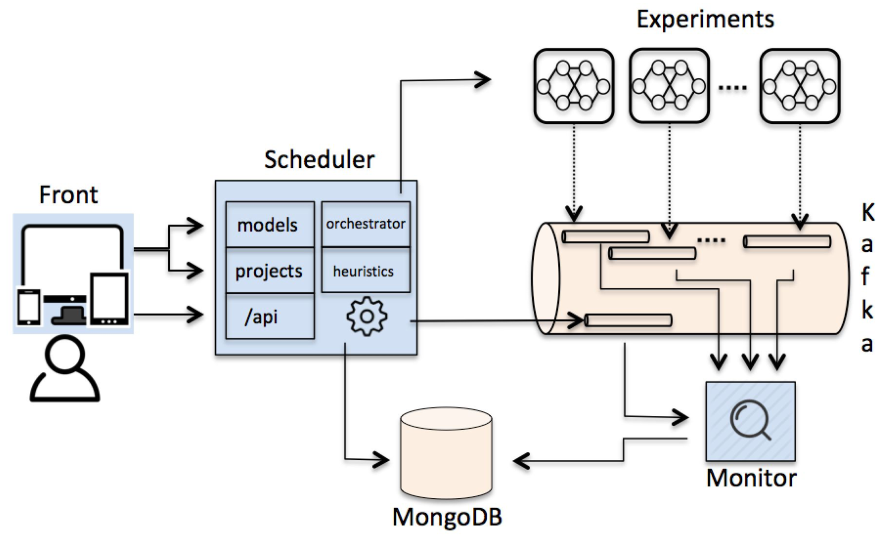

# BeagleML

BeagleML is a black-box hyperparameter tunner originally created for neural networks.

The aim of this project is to execute a neural network model with different inputs (generated by combining 
values from defined parameters).
These executions are called experiments. They can be executed in parallel, and all of them send their metrics 
to a centralized bus for further analysis.

Once finished, the value is in the analysis of these experiment metrics.

## Architecture

BeagleML requires a platform to be deployed into (deployment templates are provided in ```deploy/``` folder).

Moreover, this internal platform integration is needed to execute experiments from inside the platform, mainly to start/stop experiments.

We currently support DockerCompose (DC) - local usage -, and DCOS platform.

The architecture is composed by 3 main services - +1 tool, in case of using DockerCompose - :

- Main: ***Front web*** [(repo)](https://github.com/BBVA/BeagleML-front)

  UI to load files, start/stop experiments, and check results. It mainly interacts with the scheduler API endpoints.

- Main: ***Scheduler*** [(repo)](https://github.com/BBVA/BeagleML-scheduler)

  It is the core of the project.
  It receives the model template and project definition files from the user.
  From these files, it executes the selected heuristic which generates experiments.
  Finally, the scheduler executes and monitors these experiments.

  The experiments send their metrics to their particular Kafka topic.

- Main: ***Monitor*** [(repo)](https://github.com/BBVA/BeagleML-monitor)

  It retrieves experiments metrics from experiments Kafka topics, and store them into BBDD (MongoDB).
  It also informs the scheduler when the experiment has finished.

Each service is documented in its own repository.

- Tool: ***TensorBoard*** (docker-compose only).

  Frontend that loads metrics from ```logdir/``` path.

The architecture picture looks as follows:

  

## Functional usage

Any beagleml user should understand these concepts:

- ***Model template***.

 It is a orchestrator-specific file designed to deploy a docker container which contains a neural network model.
 Here are examples of templates for:
  - [DockerCompose](examples/dockercompose_model_template.yml).
  - [DCOS](examples/dcos_model_template.json).

 It is normally composed by a docker image and multiple environment variables (some of them are model parameters).
 Some DockerCompose/DCOS/Openshift knowledge is required to design this template.

- ***Project definition***.

 It is a YAML file where the user assigns a range of values to the same environment variables (parameters) as defined 
 previously in the model template.
 Here are examples for:
  - [DockerCompose](examples/dockercompose_project_definition.yml).
  - [DCOS](examples/dcos_project_definition.yml).

 And [here](doc/experiment_file_format.md) is the explanation of every field of this file.

Both files (```model template``` and ```project definition``` ) must be uploaded by the user using the beagleml-front UI.

With these files, the beagleml scheduler generates experiments, each one with a different combination of parameter values, 
ready to be executed.

To make it easy, in the [beagleml-template repo](https://globaldevtools.bbva.com/bitbucket/projects/BGLAI/repos/automodeling-model-template/browse) 
it is defined how users (data scientists) can fit their models into beagleml.

## Releases

BeagleML-1.0.0 is composed by:
- beagleml-front:     ```1.0.0```
- beagleml-monitor:   ```1.0.0```
- beagleml-scheduler: ```1.0.0```

+ and, when using DockerCompose:
 - tensorboard:            ```tensorflow/tensorflow:1.3.0```


## Getting Started

First of all, clone this repo to your local machine, and move to last version (currently 0.4.3) by doing:
```
$ git clone https://github.com/BBVA/BeagleML.git
$ cd BeagleMl
$ git checkout tags/1.0.0
```
Then, follow these steps:

#### Docker Compose
Local machine: Follow [docker-compose](doc/getting_started/dockercompose.md) steps.

Remote machine: Follow [docker-compose-remote](doc/getting_started/dockercompose_remote.md) steps.

#### DCOS
Follow [DCOS](doc/getting_started/dcos.md) steps.
